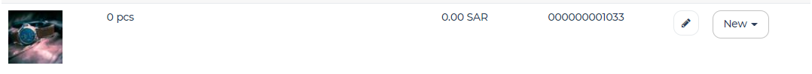

Adding a Product
================================

Merchants can add a product by:

#. Accessing the “Store Management” menu
#. Clicking on the “Products” menu
#. Clicking on “Add Product” next to the ‘Search & Filter Bar’
#. Add the following information:
   * Product Name
   * Product Image
   * Price 
   * Discount Price
      * Activated if “Sale” checkbox is selected
   * Assign to Product Category (Should have a Max) .. Remember to fix the should have a max
   * Breadcrumbs Category 
      * Appears if product has more than one category 
      * A form of navigation on websites which tells end users how they reached their current page
      * The first category the product was added to is the default breadcrumb category
   * Product Description
   * Select Inventory Item
      * Each new product results in the product being added to the Inventory Library (Store Management > geideaPOS > Inventory Library) which creates a barcode for the new product as well
      * The use case might be different if the product has more than one variation (Check Creating Variations) .. Remember to link to creating variation section when available
   * Add product variation
      * If one is not added, the first version is treated as the default category

To assign quantity to a product, check Assigning Product to Inventory .. Remember to link to Assigning product to Inventory Section

Creating Variations
-------------------------------

Merchants can use variations to provide end users with different options for certain products (e.g. Size, Color, etc.) 
Merchants can add variations by:

#. Adding a new product OR clicking on an existing product’s image
#. Clicking on “Add Option” under “Product Variations”
#. Add the following information:
   * Variation Name (e.g. ‘Small’ if it’s for a shirt ‘Long Tee’)
   * The inventory item the variation links to:
      * The first variation has a default link to the current product
      * The second variation links to a ‘New’ product in the inventory 
      * This creates a new inventory item under the same product as such “Product Name (Variation Name)’ so for a shirt named ‘Long Tee’, the new variation would be “Long Tee (Small)” 
   * Price of Variation
   * Discount Price of Variation

Assign Product to Inventory Item and Managing Quantity
------------------------------------------------------------------
Once a product (or variation of a product) has been created, a barcode is generated and the product is linked to the inventory. This product can be accessed from:
   ‘Store Management > geideaPOS > Inventory Library’
If no variation has been added, the product is seen as an image in the ‘Inventory Library’ as such:

