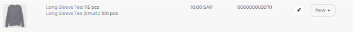

Adding a Product
================================

To add a product:

#. Access  the “Store Management” menu
#. Click on the “Products” menu
#. Click on “Add Product” next to the ‘Search & Filter Bar’
#. Add the following information:

   * Product name
   * Product image
   * Price 
   * Discount price

      * Activated if “Sale” checkbox is selected
      
   * Assign to Product Category
   * Main Category

      * Appears if product belongs to more than one category
      * Used as a form of navigation on websites to tell end users how they reached their current page
      * The first category the product was added to is the default main category
   * Product description
   * Select inventory item

      * Each new product will be  added to the Inventory Library (Store Management > geideaPOS > Inventory Library) which creates a barcode for the new product
      * The use case might be different if the product has more than one variation (Check :ref:`Creating Variations`)
   * Add product variation

      * If one is not added, the first version is treated as the first variation

To assign quantity to a product, check :ref:`Assign Product to Inventory Item and Managing Quantity`

Creating Variations
-------------------------------

Use variations to provide end users with different options for certain products (e.g. Size, Color, etc.)
To add variations:

#. Add a new product OR click on an existing product’s image
#. Click on “Add Option” under “Product Variations”
#. Add the following information:
   * Variation name (e.g. ‘Medium’ if it’s for a shirt ‘Long Tee’)
   * The inventory item the variation links to:
      * The first variation has a default link to the current product
      * The second variation links to a ‘New’ product in the inventory
      * This creates a new inventory item under the same product as “Product name (Variation name)’ so for a shirt named ‘Long Tee’, the new variation would be “Long Tee (Medium)” 
   * Price of variation
   * Discount price of variation

Assign Product to Inventory Item and Managing Quantity
------------------------------------------------------------------
Once a product (or variation of a product) has been created, a barcode is generated and the product is linked to the inventory. This product can be accessed from:

.. code-block:: text

   ‘Store Management > geideaPOS > Inventory Library’

To add inventory (product quantity) for the first variation:

#. Click on ‘New > Receipt’
#. Add the following information:

    * Warehouse
    * Item
    * Quantity
    * Cost per unit

To add inventory for the second variation is a bit different:

#. Click on the second variation (In the above example, it would be “Long Sleeve Tee (small)”
#. At the top right, click ‘New > Receipt’
#. Add the following information:

    * Warehouse
    * Item
    * Quantity
    * Cost per unit

..
   Bulk Import & Rules (English and Arabic)
   -------------------------------------------------

   Merchants can also add products via bulk import by accessing:

   .. code-block:: text

      Settings > Integrations & Data Sharing > Data Import > Google Spreadsheet

   You can import items without variations, items with variations or both of them at the same time.

   Bulk Import Fields
   ^^^^^^^^^^^^^^^^^^^^^^^^^^^^^^^^^^

   * **Product name:en** (product name in English)
   * **Product name:ar_SA** (product name in Arabic)
   * **Product description:en** (product description in English)
   * **Product description:ar_SA** (product description in Arabic)
   * **Product image link** (link for the product image .jpg) → check formats 
   * **Product category:en** (product category name in English)
   * **Product category:ar_SA** (product category name in Arabic)
   * **Variation name:en** (variation name in English)
   * **Variation name:ar_SA** (variation name in Arabic)
   * **Barcode** (12-digit code)
   * **Cost per unit** (purchasing cost)
   * **Price**
   * **Discount price**
   * **Tax**
   * **Quantity**

   Bulk Import: Rules for Variations
   ^^^^^^^^^^^^^^^^^^^^^^^^^^^^^^^^^^^^^^^^^^^^^

   #. Items without variations:

      #. each string means one product will be imported
      #. *variation name:en* and *variation name:ar_SA* should be empty

   #. Items with variations:

      #. the *string for the product*

         #. should contain *Product name:en* and *Product name:ar_SA *
         #. should NOT contain *variation name:en* and *variation name:ar_SA* and *Barcode*
         #. is not imported
      #. the *string for each variation of the product*

         #. should **NOT** contain *Product name:en* and *Product name:ar_SA*
         #. should contain *variation name:en* and *variation name:ar_SA* and *Barcode*
         #. is imported

   Bulk Import: Rules for Empty Fields
   ^^^^^^^^^^^^^^^^^^^^^^^^^^^^^^^^^^^^^^^^^^^^^^^^^^^^^

   #. If *Product image link* is empty, then item will be added without a picture
   #. If *Cost per unit*, *Price*, *Discount price* and *Tax* are empty – these fields will not be added
   #. The *Quantity* field

      #. If a number is added, then a receipt transaction to the default warehouse will be created.
      #. If not, the inventory Item will be created with an out of stock state.
   #. **A barcode is strongly requested!** If the merchant has no existing barcodes for his items to bulk import, then we suggest to autofill it in a Google Sheet (e.g. 000000000001, 000000000002).
   #. If the merchant already has an existing barcode in the database and tries to import any item with the same barcode, then the existing item will be replaced with the data from the Google Sheet – **BE CAREFUL!** So, the best way is to bulk import to a new/empty Store.

   Bulk Import: Rules for Categories
   ^^^^^^^^^^^^^^^^^^^^^^^^^^^^^^^^^^^^^^^^^^^^^^^^^^^^^^

   #. If this field is left empty, the item will be left as uncategorized.
   #. If an item has a category and a subcategory, please use the forward slash [Category/Subcategory] OR [e.g. Mens/Shoes]
   #. If you wanna assign an item to a few categories, please type it with comma [Category 1, Category 2] OR [e.g. Desserts, Ice Cream]
   #. P.2 and P.3 are applicable to Product category:ar_SA, however, from a right-to-left orientation. [ترحيب / أساور] → In this case, ترحيب is the main category and أساور is the subcategory.
   #. If you type a new category name, then a new category will be created and the item will be assigned.

