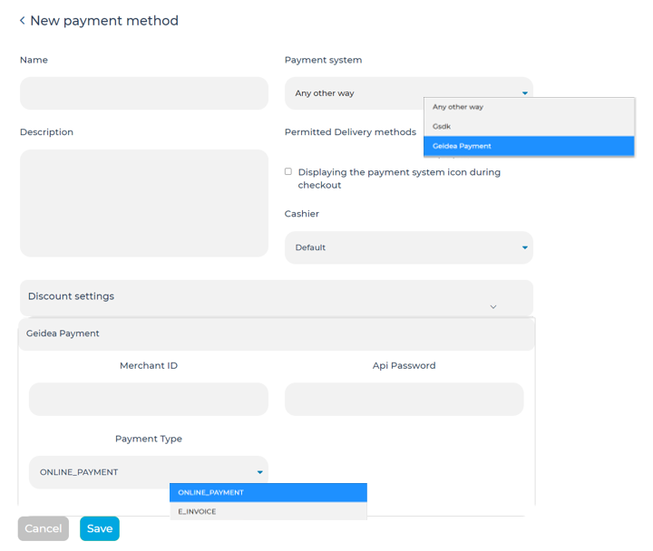

Payment and Delivery
======================================

Payment and delivery methods need to be set up, since merchants will not be able to sell products online if either one of these factors is missing.Every payment method must be linked to at least one delivery method.

Adding a Payment Method using Geidea Payment system
------------------------------------------------------------

Every payment method must be linked to at least one delivery method.
Merchants can add a payment method by accessing: 

* Store Management > Settings > Customer Payment Methods
* Clicking on “Add Payment Method” button
* Adding the following information:

   * Payment Name
   * Payment System

      * Have to add Merchant ID provided by Geidea
      * Have to add API Password provided by Geidea
      * Selecting the payment type

   * Link payment to the suitable delivery method
   * Add the cashier/cashiers that can use the payment method

Adding a Delivery Method
-------------------------------------------------

Merchants can add a delivery method by accessing:

* Store Management > Settings > Delivery Methods
* Clicking on ‘Add Delivery Method’
* Adding the following information:

   * Name - how end users will see it
   * Delivery Service - merchants can select from the following delivery services 

      * Pickup
      * Aramex
      * Other (merchant’s courier)
      * Only Digital Goods (for subscription/online goods)

   * Description
   * Delivery Cost

      * Left blank if the shipping cost will be determined after the order

   * Free Shipping (once order reaches this limit, shipping is free)
   * City for delivery
   * Permitted Payment Methods
   * Merchants can add an additional field for the order form

      * along with a hint for customers for the additional field

   *  Delivery commentary for letters
   * The order method can be limited to:
   
      * Certain products
      * Certain categories
      * Default country

Once a delivery method has been added, time slots for the new method can be adjusted in the following way:

* Access ‘Settings > Delivery Method’
* Click “Change” on the delivery method to adjust the time slots for the selected method
* Access “Set a specific time” to edit the courier service time
* Merchants are shown a calendar for which time windows can be selected for given dates
* Merchants can also create custom rules for multiple dates using the “Rules for time slots” section

Adding a Delivery Method - Aramex Integration
^^^^^^^^^^^^^^^^^^^^^^^^^^^^^^^^^^^^^^^^^^^^^^^^^^^^^^^^^^

**Client Information**

* *Username* - provided to user when registering with Aramex 
* *Password* - provided to user when registering with Aramex
* *Version* - Based on the API version the user is using to invoke the web service
* *Account Number* - requested from Aramex
* *Account PIN* - requested from Aramex
* *Account Entity* - 3 letter code provided by Aramex
* *Account Country Code* - Two Letter Code Identifying the Country (`Check API Manual <https://www.aramex.com/docs/default-source/resourses/resourcesdata/shipping-services-api-manual.pdf>`_)